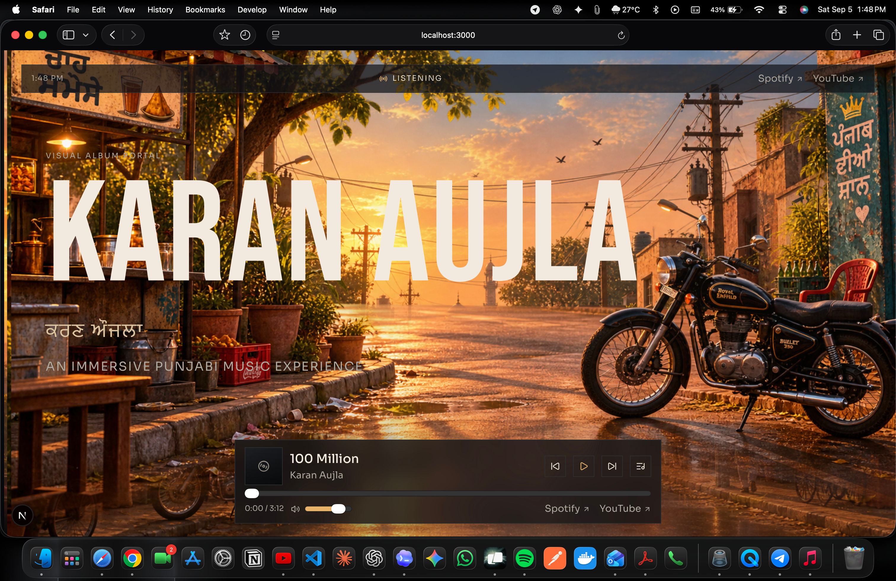

# OG Websites — Karan Aujla Music Experience

> A cinematic, responsive music experience built with Next.js, React and TypeScript, featuring a custom local-audio player and playlist architecture.


<p align="center">
  
</p>

## Overview

**OG Websites** is an independent, music-focused web experience inspired by the visual language of contemporary Punjabi music culture.

The project combines an immersive cinematic interface with a custom browser-based music player. It is designed to grow from an artist-inspired landing page into a richer music experience with playlists, search, favorites, shuffle/repeat, visualizers, release pages and other features.

> **Important:** This is an independent project and should not be represented as an official Karan Aujla website without authorization. Only use music, artwork, photographs, trademarks and other copyrighted material that you are legally permitted to use.

## Features

### 🎵 Custom Music Player
- Play / Pause
- Previous / Next
- Automatic next-track playback
- Progress tracking
- Seeking / scrubbing
- Volume control
- Mute / unmute
- Current-track metadata
- Local MP3 playback

### 📜 Playlist
Audio files can be stored in `public/audio/` and exposed through the application's playlist.

The playlist is designed to support:
- Direct song selection
- Current-track highlighting
- Track switching
- Artist/title metadata
- Large playlists
- Desktop and touch/mobile interaction

### 🎨 Cinematic UI
- Full-screen hero artwork
- Layered typography
- Atmospheric visual treatment
- Dark, minimal aesthetic
- Responsive layout
- Integrated bottom music player

### 📱 Responsive Experience
Designed for desktop, laptop, tablet and mobile screens.

## Technology Stack

| Technology | Purpose |
|---|---|
| Next.js | React application framework |
| React | UI and component architecture |
| TypeScript | Type-safe development |
| CSS | Styling and responsive design |
| HTML5 Audio API | Local music playback |
| Node.js | Runtime/development |
| npm | Package management |

Exact dependency versions are defined in `package.json`.

## Project Structure

```text
ogwebsites/
├── app/
│   ├── components/
│   │   └── hero/
│   │       ├── hero.tsx
│   │       ├── hero-section.tsx
│   │       ├── hero-scene.tsx
│   │       ├── hero-typography.tsx
│   │       ├── hero-navigation.tsx
│   │       └── hero-music-player.tsx
│   ├── globals.css
│   ├── layout.tsx
│   └── page.tsx
├── public/
│   ├── audio/
│   │   ├── track1.mp3
│   │   ├── track2.mp3
│   │   └── ...
│   └── images/
│       └── hero/
│           └── master-reference.png
├── package.json
├── tsconfig.json
└── README.md
```

The repository structure may evolve as new features are added.

## Getting Started

### Prerequisites

- Node.js 18+ recommended
- npm, yarn, pnpm or Bun
- A modern browser

Check your environment:

```bash
node --version
npm --version
```

### Installation

```bash
git clone https://github.com/KunjMaheshwari/ogwebsite.git
cd ogwebsite
npm install
```

### Development

```bash
npm run dev
```

Then open:

```text
http://localhost:3000
```

## Adding Audio

Place legally obtained/licensed audio files in:

```text
public/audio/
```

Example:

```text
public/audio/
├── softly.mp3
├── wavy.mp3
├── winning-speech.mp3
├── 100-million.mp3
└── ...
```

A public asset can then be referenced as:

```text
/audio/softly.mp3
```

Prefer simple, readable filenames. The application should not assume that every filename has the same format, so filenames containing spaces or other normal characters should be handled safely.

### Copyright & Licensing

Only host audio that you have the legal right to distribute. This project does not provide or endorse unauthorized downloads or redistribution of commercial music.

## Music Architecture

The player should use a single source of truth for playlist state and one persistent `HTMLAudioElement`.

```text
Playlist
   │
   ├── Current Track
   ├── Previous
   ├── Next
   └── Selected Track
          │
          ▼
   HTMLAudioElement
          │
          ├── play()
          ├── pause()
          ├── currentTime
          ├── duration
          ├── volume
          └── muted
```

Example playlist entry:

```ts
{
  id: "softly",
  title: "Softly",
  artist: "Karan Aujla",
  src: "/audio/softly.mp3"
}
```

Keeping playlist metadata separate from UI components makes the player easier to extend.

## Testing

Music functionality should be verified in a real browser rather than only through static code inspection.

### Functional Checklist

- [ ] Application starts successfully
- [ ] Playlist opens
- [ ] All expected songs appear
- [ ] Selecting a song changes the current track
- [ ] Audio actually starts
- [ ] `audio.currentTime` increases while playing
- [ ] Pause works
- [ ] Resume works
- [ ] Next works
- [ ] Previous works
- [ ] Auto-next works
- [ ] Progress updates
- [ ] Seeking works
- [ ] Volume works
- [ ] Mute works
- [ ] Missing audio does not crash the application
- [ ] No unexpected console errors
- [ ] No failed audio requests
- [ ] Mobile/touch interaction works

Run the scripts available in `package.json`, for example:

```bash
npm run lint
npm run build
```

If available:

```bash
npm test
npm run typecheck
```

## Development Principles

### Preserve the visual identity

When adding functionality:
- Reuse existing components
- Preserve typography and spacing
- Preserve the cinematic aesthetic
- Avoid unrelated redesigns
- Keep animations subtle
- Maintain responsive behavior

### Component architecture

Prefer focused responsibilities:

```text
Hero
 ├── HeroNavigation
 ├── HeroScene
 ├── HeroTypography
 └── MusicPlayer
      ├── PlayerControls
      ├── Playlist
      └── ProgressControl
```

Avoid creating competing audio instances when changing tracks.

## Roadmap

### Phase 1 — Core Player
- [x] Custom music player foundation
- [x] Local audio support
- [ ] Playlist UI
- [ ] Song selection
- [ ] Robust next/previous behavior
- [ ] Auto-next
- [ ] Search
- [ ] Shuffle
- [ ] Repeat

### Phase 2 — Personalization
- [ ] Favorite songs
- [ ] Recently played
- [ ] Persistent player state
- [ ] User-created playlists
- [ ] Listening statistics

### Phase 3 — Immersive Experience
- [ ] Dynamic album artwork
- [ ] Audio visualizer
- [ ] Full-screen player
- [ ] Animated track transitions
- [ ] Properly licensed synchronized lyrics

### Phase 4 — Artist/Release Experience
- [ ] Album/release pages
- [ ] Latest releases
- [ ] Official music-video links
- [ ] Gallery
- [ ] Official social links
- [ ] Artist information

### Phase 5 — Platform Infrastructure
- [ ] Authentication
- [ ] User profiles
- [ ] Cloud playlists
- [ ] Backend API
- [ ] Database integration
- [ ] Analytics
- [ ] Production monitoring

## Deployment

A typical production workflow is:

```bash
npm install
npm run lint
npm run build
npm start
```

For larger media libraries, consider object storage and a CDN rather than placing large collections of audio directly in the application deployment.

## Security & Production Considerations

Before production deployment:
- Keep secrets in environment variables.
- Never expose private API keys in client-side code.
- Validate external API responses.
- Protect authenticated endpoints.
- Add rate limiting to public APIs where appropriate.
- Monitor failed media requests.
- Review copyright and licensing requirements for every asset.
- Use object storage/CDN infrastructure for large media libraries.

## Scalability

A future production architecture could separate application traffic from media delivery:

```text
Browser
   │
   ▼
Next.js Application
   │
   ├── API
   ├── Authentication
   └── Database
          │
          ▼
       User Data

Audio Files
   │
   ▼
Object Storage
   │
   ▼
CDN
   │
   ▼
Browser
```

This allows the application and media-delivery layers to scale independently.

## Contributing

For collaborative development:

```bash
git checkout -b feature/your-feature
```

Make focused changes, test locally, run lint/build checks, and commit with a descriptive message:

```bash
git commit -m "feat: add playlist search"
```

Pull requests should describe:
- What changed
- Why it changed
- How it was tested
- Known limitations

## License

Unless a separate license file is provided, this project should be treated as private/proprietary.

Third-party assets and media may have separate licenses and usage restrictions.

## Author

**Kunj Maheshwari**

Software Engineer | QA Automation | Full-Stack Development | AI & LLM Engineering

GitHub: https://github.com/KunjMaheshwari

## Project Vision

The long-term goal of **OG Websites** is to combine the visual impact of a cinematic artist website with the interaction model of a modern music application.

```text
Cinematic Design
       +
Custom Music Player
       +
Playlist Experience
       +
Immersive Visuals
       +
Scalable Architecture
       =
   OG Websites
```

---

<p align="center">
  Built with Next.js, React, TypeScript, and a passion for great music experiences.
</p>
